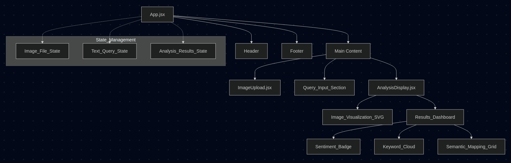

# UI Component Hierarchy & Architecture

This document outlines the structural design and data flow of the **LimiAI-Assessment frontend**.

---

## 🏗️ Hierarchy Diagram

## 📐 Wireframe Overview

The application follows a **Vertical Center-Stack** layout designed for focus and clarity.

### 1. Header (Strategic Brand Presence)
- **Top Center**: Brand Logo (BrainCircuit) and Title.
- **Subtitle**: Minimalist description with soft text rendering.

### 2. Input Zone (Actionable Area)
- **Drop Zone**: Large, interactive area with SVG icons for file selection.
- **Search Bar**: A combined text input and action button with loading indicators.

### 3. Result View (Dynamic Visualization)
- **Primary Section**: The analyzed image with an absolute-positioned SVG layer for bounding boxes.
- **Sidebar**: A structured panel with color-coded sentiment indicators and categorized tags (Keywords vs. Semantic Mapping).

---

## 🎨 Design Principles
- **Glassmorphism**: Using `backdrop-filter: blur(12px)` for a sophisticated, modern feel.
- **Smooth Transitions**: All state changes (loading, results appearing) use CSS `fades` and `transforms`.
- **High-Contrast Typography**: Leveraging Inter/Roboto for maximum legibility in a dark environment.
